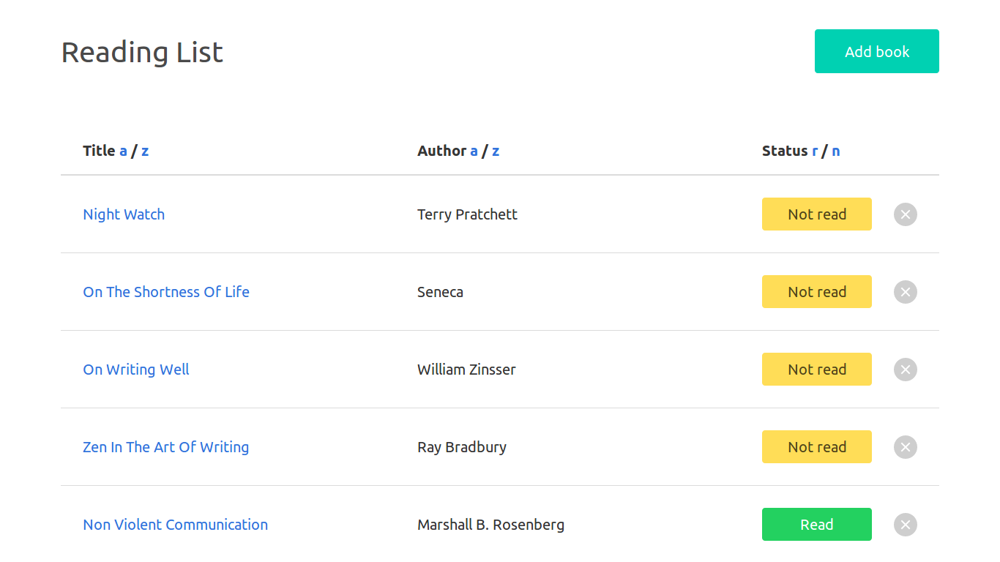

# JS Reading List

A simple reading list built with ES6, [Local Storage](https://developer.mozilla.org/en-US/docs/Web/API/Storage/LocalStorage), and [Bulma](https://bulma.io/).

## Demo

[lujanfernaud.com/js-reading-list](http://lujanfernaud.com/js-reading-list/)

## Screenshot

<kbd>
  
</kbd>

## Notes

You can reset the list of books by typing `localStorage.clear()` in the browser's console and refreshing the page, or by deleting all books manually.
